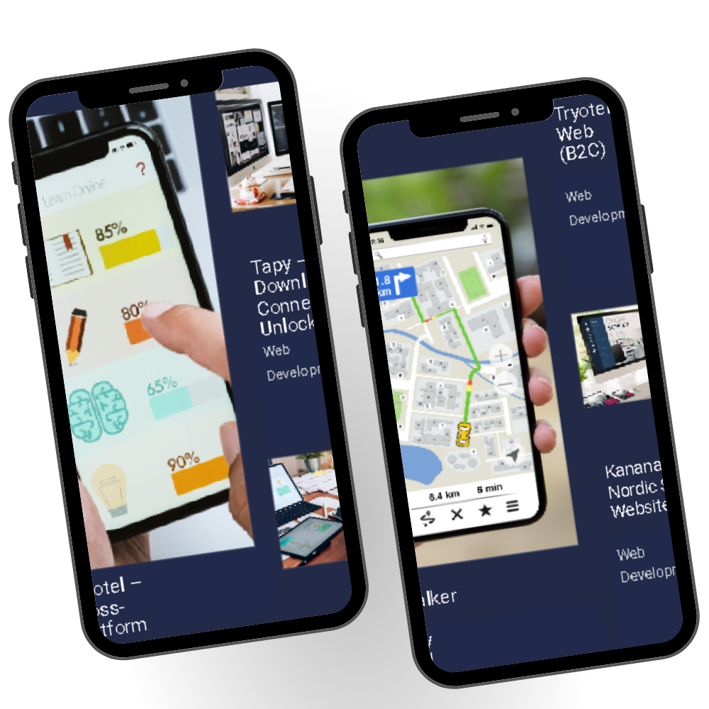

# Portfolio
 
#Portflio is a fully responsive personal portfolio website, responsive for all devices, built using HTML and CSS.

## Demo

 

 &nbsp;
 &nbsp;

## Built With

# Mock Portfolio
🚀 Dive into my world of code and creativity! Explore projects, check my skills, and peek into my tech journey. Responsively designed for all screens. Built with ❤️, HTML, and CSS.
👉 [Check it out!](https://github.com/maltsh/Portfolio)

This project was built using these technologies.

- CSS
- HTML

## Features

**📖 Multi-Page Layout**

**🎨 Styled with Css with easy to customize colors**

**📱 Multi-screen Responsive**

## License

MIT

### Show your support

Give a ⭐ if you like this website!
